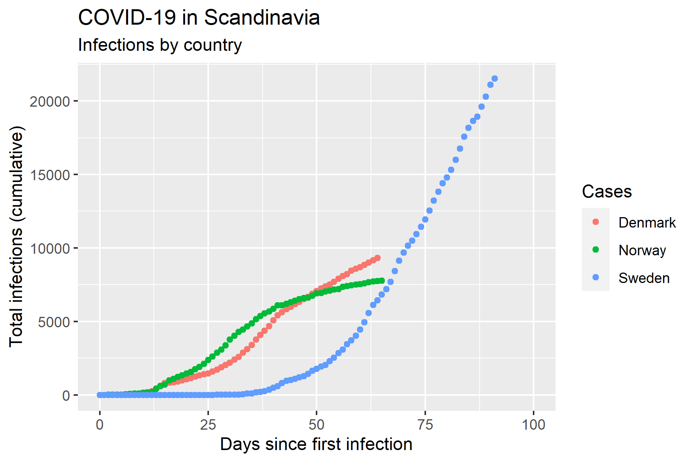
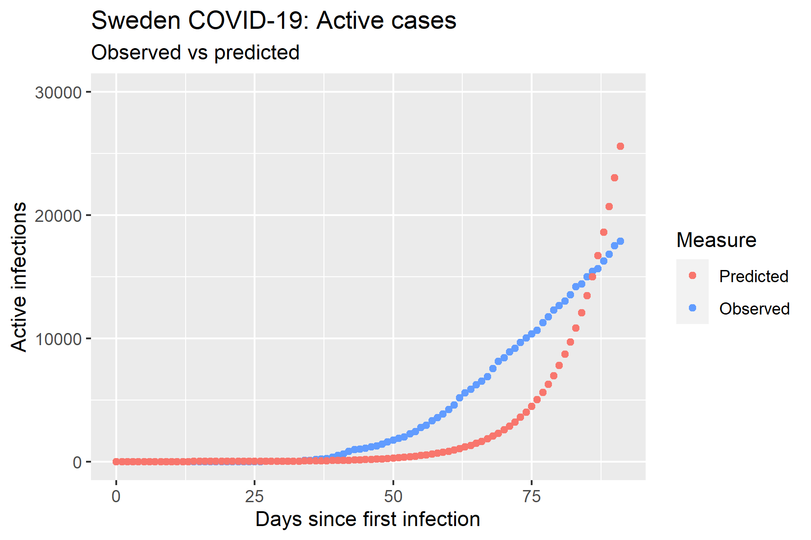

```{r setup, include=FALSE}
knitr::opts_chunk$set(echo = FALSE)
```

## Modelling the COVID-19 pandemic: SIR

```{r,  out.width =  "800px", fig.align = 'center'}

```
$$\frac{dS}{dt} = \beta\cdot S\cdot I $$
$$\frac{dI}{dt} = \beta\cdot S\cdot I - \gamma\cdot I $$
$$\frac{dR}{dt} = \gamma*I $$

## Observed cases and recoveries in Denmark
```{r,  out.width =  "700", fig.align = 'center'}
knitr::include_graphics("../results/04_Denmark_obs.png")
```

## Observed cases in Scandinavia
```{r,  out.width =  "580px", fig.align = 'center'}

```

## Fitting beta and gamma to the data
How to find the optimal values of $\beta$ and $\gamma$?

One answer: Minimize the residual square error (RSS) between the observed number of infections and the predicted.

For this, we need:

- A way to solve the ODEs: function ode() from R package deSolve
- An optimizer: built-in R function optimize()

## Resulting parameters: Sweden

Optimized values were found to $\beta = 0.56$ and $\gamma = 0.44$

giving a reproductive rate of $R_0 = 1.25$

```{r,  out.width =  "580px", fig.align = 'center'}

```

## Making predictions

```{r,  out.width =  "700", fig.align = 'center'}

```

